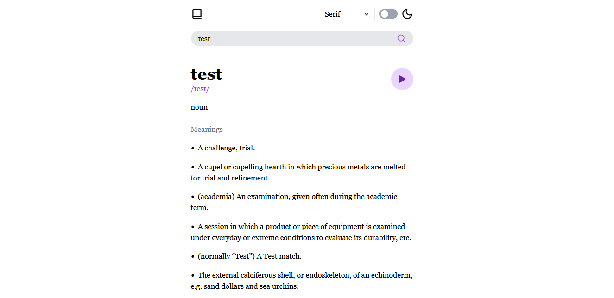

# Frontend Mentor - Dictionary solution

This is a solution to the [Dictionary web app challenge on Frontend Mentor](https://www.frontendmentor.io/challenges/dictionary-web-app-h5wwnyuKFL). Frontend Mentor challenges help you improve your coding skills by building realistic projects.

## Table of contents

- [Overview](#overview)
  - [The challenge](#the-challenge)
  - [Screenshot](#screenshot)
  - [Links](#links)
- [My process](#my-process)
  - [Built with](#built-with)
  - [What I learned](#what-i-learned)
- [Author](#author)

## Overview

### The challenge

Users should be able to:

- View the optimal layout for the interface depending on their device's screen size
- See hover and focus states for all interactive elements on the page

### Screenshot

### Links

- Solution URL: (https://github.com/DarmaPutra55/frontend-mentor-news-homepage)
- Live Site URL: (https://darma-english-dictionary.netlify.app/)

## My process

### Built with

- Semantic HTML5 markup
- [TailwindCss](https://tailwindcss.com/)
- [React](https://reactjs.org/) - JS library
- [Free Dictionary API](https://dictionaryapi.dev/) - Dictionary REST API
- [React Icons](https://react-icons.github.io/react-icons/) - Free Icon to use with React

### What I learned

In this project I learn to:
- How to create a website based on observation
- Utilize free asset to create a website with similar design as to observed website
- Integrating REST API with React without using package such as Tanstack Query

## Author

- Linkedin - [I Gusti Agung Gede Darma Putra](https://www.linkedin.com/in/i-gusti-agung-gede-darma-putra-0b8025237/)
- Frontend Mentor - [I Gusti Agung Gede Darma Putra](https://www.frontendmentor.io/profile/DarmaPutra55)
